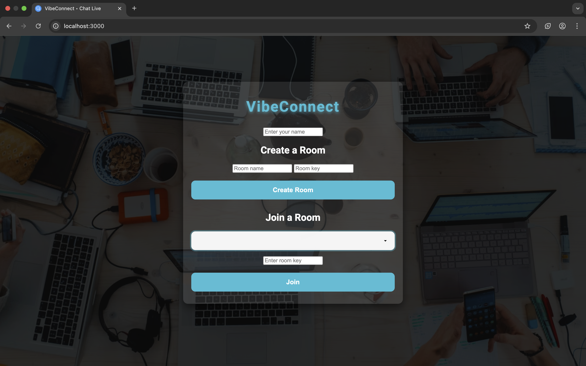

# VibeConnect • Chat Live

VibeConnect is a real-time web-based chat application where users can create or join chat rooms, send messages instantly, and experience a clean and modern interface.

## 🚀 Features

- Create or join secure chat rooms with a room key
- Real-time messaging using Socket.IO
- Basic formatting: **bold**, *italic*, clickable links
- Username-based identification
- Smooth UI with responsive design
- Prevents duplicate usernames

## 🛠️ Technologies Used

- HTML, CSS, JavaScript
- Node.js + Express
- Socket.IO for WebSocket communication

## 📦 Setup Instructions

1. **Clone the repository / extract files**
2. **Install dependencies:** - npm install
